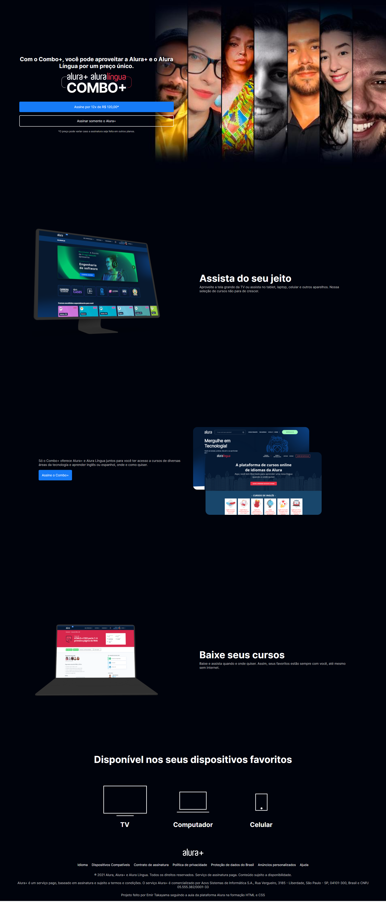

# projeto alura plus

Este é um projeto feito com orientação da Alura que estou utilizando para reforçar o conhecimendo do HTML e CSS.

 
## Sobre o projeto
[🎨Template do projeto](https://www.figma.com/file/ibWktwVpnog76rMYOdVhks/Dispondo-elementos-com-flexbox-e-grid)

[🔗Clique aqui para acessar](https://ngemir.github.io/projeto-alura-plus/)
